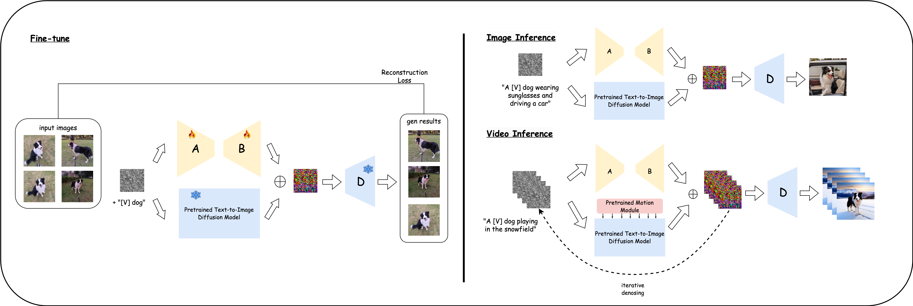
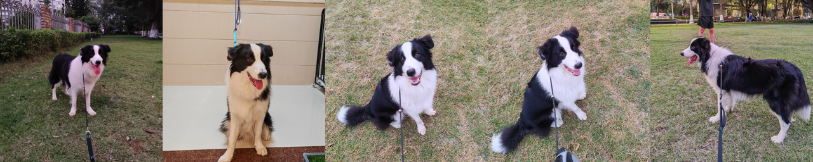
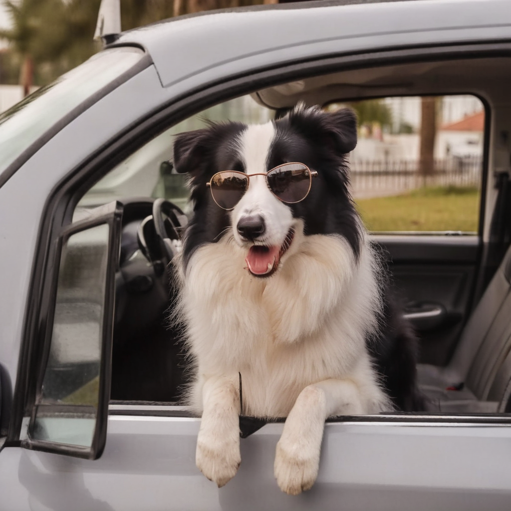
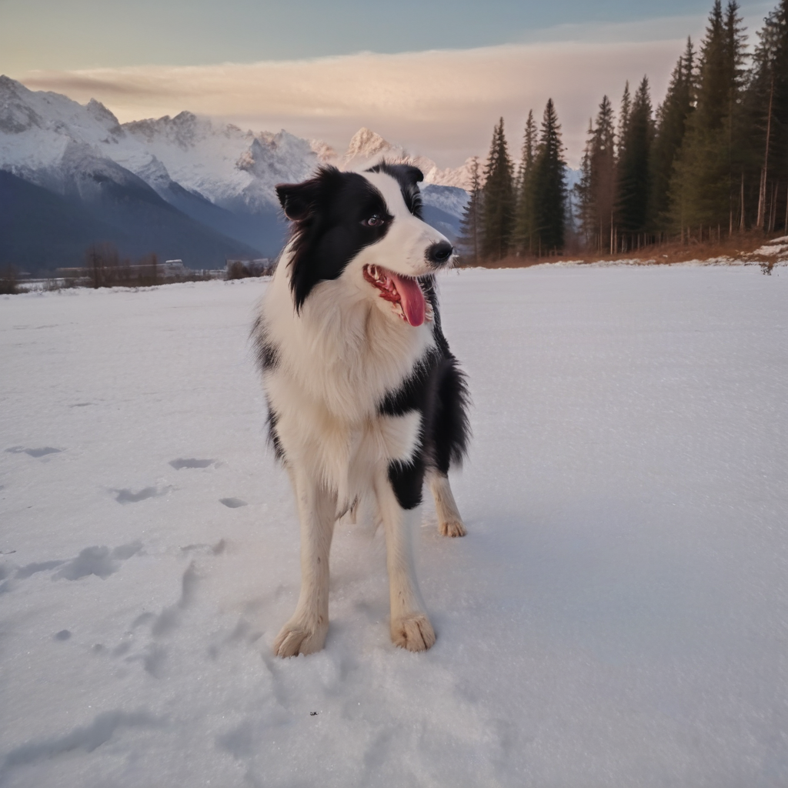
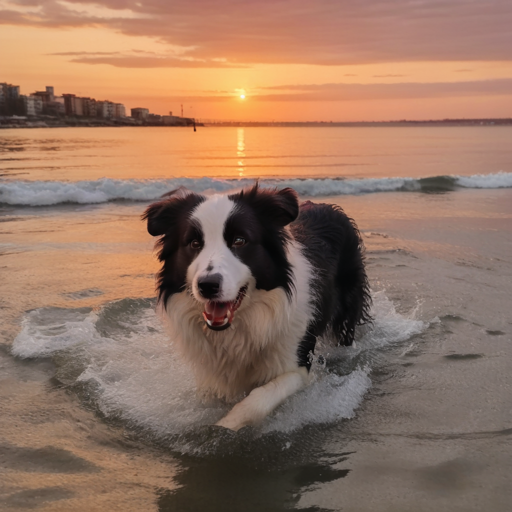
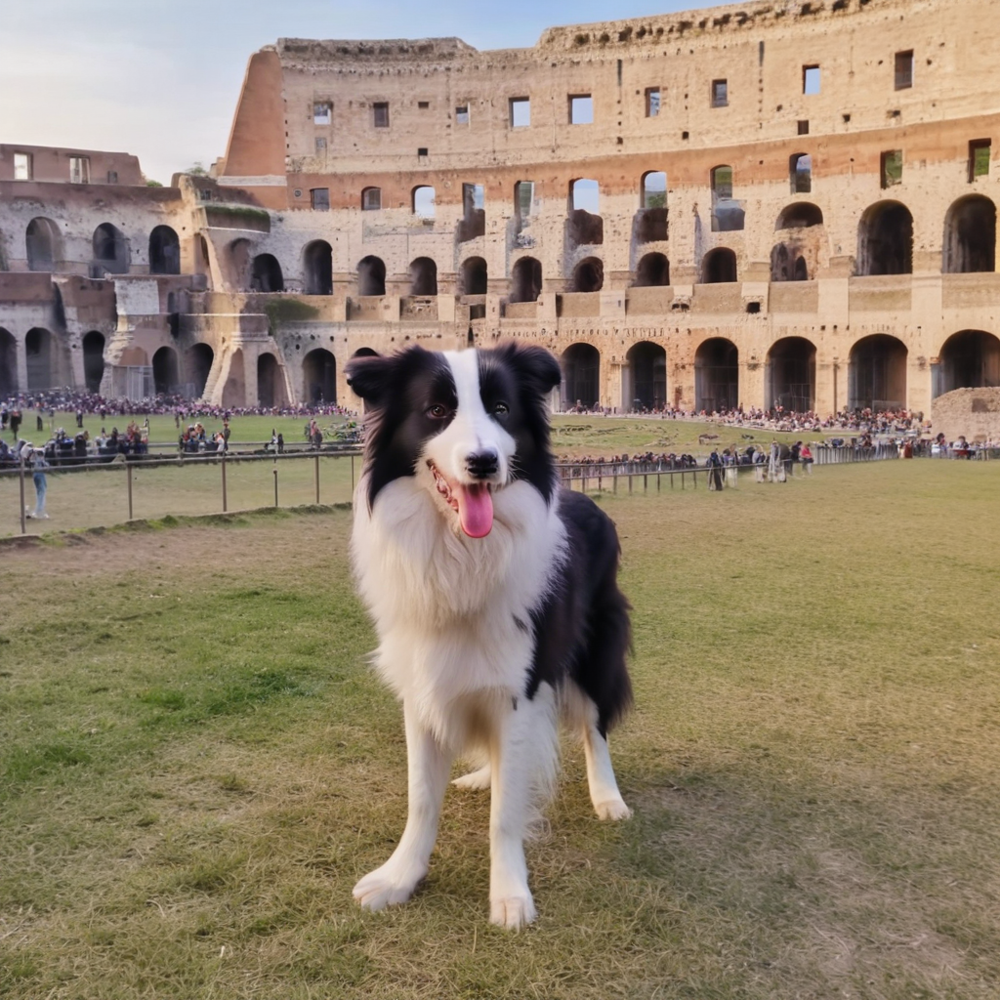

# PetAvatar

This project uses DreamBooth + LoRA to generate customized model for your own pets, and uses AnimateDiff to animate your pets.



[Project Page](https://rorschach-xiao.github.io/PetAvatar-Gallery/) | [Dataset](https://drive.google.com/drive/folders/1HSfSxqN8qSh-l2piE7AzvfPsRmAWIadT?usp=sharing)


> pet images from user


<!-- <style>
.center 
{
  width: auto;
  display: table;
  margin-left: auto;
  margin-right: auto;
}
</style> -->


<center>

|prompts|static results|animated results|
|:-:|:---:|:---:|
|`a photo of a TOK collie dog `<br>` wearing sunglasses and`<br>` driving a car, high resolution, `<br>` realistic, 4k, high quality`|||
|`a photo of a TOK collie dog `<br>`playing in the snowfield,`<br>` mountain in background,`<br>` high resolution, realistic, 4k,`<br>` high quality`| |
|`a photo of a TOK collie dog `<br>`swimming in the sea, `<br>`setting sun in background,`<br>` orange sky, high resolution, `<br>`realistic, 4k, high quality`|||
|`a photo of a TOK collie dog `<br>`standing in the Colosseum `<br>` in Rome, high resolution, `<br>` realistic, 4k, high quality`|||

</center>

## Dataset
The dataset we collect includes 13 subjects of 2 different classes, dog and cat. The dataset contains a variable number of images per subject (4-5). Images of the subjects are usually captured in different conditions, environments and under different angles. You can download the dataset from our google drive: [Link](https://drive.google.com/drive/folders/1HSfSxqN8qSh-l2piE7AzvfPsRmAWIadT?usp=sharing).


|Spieces|Breed|Number of Images|
|-|-|-|
|Dog|Collie|5|
|Dog|Bull|5|
|Dog|Golden Retriever|5|
|Dog|Corgi|4|
|Dog|Dachshund|4|
|Dog|Doberman|4|
|Dog|Hiromi|4|
|Cat|Ragdoll|5|
|Cat|Maine|5|
|Cat|British ShortHair Silver|5|
|Cat|British ShortHair Gold|5|
|Cat|Bengal|5|
|Cat|Abyssinian|5|


## Preparations
### Setup repo and create environment

```shell
git clone --recurse-submodules https://github.com/rorschach-xiao/PetAvatar.git
git submodule update --recursive --init

cd PetAvatar

conda env create -f environment.yaml
conda activate diffuser
```

### Setup animatediff submodule
#### prepare animatediff-sd15
- go to src/animation/AnimateDiff-sd15
- follow [readme](src/animation/AnimateDiff_sd15/README.md) to create a conda environment named `animatediff`, also put stable-diffsuion-sd15 repo/motion-module into corresponding folders

#### prepare animatediff-sdxl
- go to src/animation/AnimateDiff-sdxl
- follow [readme](src/animation/AnimateDiff_sdxl/README.md) to create a conda environment named `animatediff_xl`, also put stable-diffsuion-sdxl repo/motion-module into corresponding folders


## Usage
### prepare your data
put the 3-5 images of same pet in `PetAvatar/${YOUR PET NAME}`, make sure they are in `jpeg` format. The folder structure looks like

```
- PetAvatar
  |- ${YOUR PET NAME}
    |- *.jpeg
    |- *.jpeg
    |- *.jpeg
    |- ...
```

run the following scripts to generate captions for your pet images:

```shell
python src/customization/preprocessing_data.py --img_dir ${YOUR PET NAME} --vis_dir ${YOUR PET_NAME}_vis --breed ${BREED} --species ${SPECIES}

e.g.
python src/customization/preprocessing_data.py --img_dir gulu --vis_dir gulu_vis --breed collie --species dog
```

### train your own dreambooth-lora model
SD15 based model will yield bad results sometimes, SDXL based model is recommended.

```shell
# train sd15 based dreambooth-lora
conda activate diffuser
bash scripts/train_dreambooth_lora_sd15.sh ${INPUT_DATA_DIR} ${MODEL_OUTPUT_DIR} ${SPECIES} ${BREED}
e.g. 
bash scripts/train_dreambooth_lora_sd15.sh gulu lora_weights_sd15/gulu dog collie

# train sdxl based dreambooth-lora
conda activate diffuser
bash scripts/train_dreambooth_lora_sdxl.sh ${INPUT_DATA_DIR} ${MODEL_OUTPUT_DIR} ${SPECIES} ${BREED}
e.g. 
bash scripts/train_dreambooth_lora_sdxl.sh gulu lora_weights_sdxl/gulu dog collie

```

### generate customized images
Generate costomized images using the fine-tuned lora model in previous step. You can change the prompts in ./prompts/prompts.txt to obtain different outputs. The results can be found under `./sd15_output/${OUTPUT_dir}` or `./sdxl_output/${OUTPUT_dir}`

```shell
# if your lora model is based on SD15
bash scripts/gen_image_inference.sh sd15 ${LORA_PATH} ${PROMPT_FILE}
e.g.
bash scripts/gen_image_inference.sh sd15 ./lora_weights_sd15/gulu/pytorch_lora_weights.safetensors ./prompts/prompts.txt

# if your lora model is based on SDXL
bash scripts/gen_image_inference.sh sdxl ${LORA_PATH} ${PROMPT_FILE}
e.g.
bash scripts/gen_image_inference.sh sdxl ./lora_weights_sdxl/gulu/pytorch_lora_weights.safetensors ./prompts/prompts.txt

```

### generate customized videos
Generate costomized videos using the fine-tuned lora model in previous step. You can change the prompts in ./prompts/prompts.txt to obtain different outputs. The results can be found under `./sd15_video/${OUTPUT_dir}` or `./sdxl_video/${OUTPUT_dir}`

```shell
# if your lora model is based on SD15
conda activate animatediff
bash scripts/gen_video_inference.sh ${LORA_PATH} ${PROMPT_FILE} ${OUTPUT_DIR} ${STEP} ${GUIDANCE_SCALE} ${LORA_ALPHA} sd15

e.g.
bash scripts/gen_video_inference.sh ./lora_weights_sd15/gulu/pytorch_lora_weights.safetensors ./prompts/prompts.txt gulu 50 8.5 0.85 sd15

# if your lora model is based on SDXL
conda activate animatediff_xl
bash scripts/gen_video_inference.sh ${LORA_PATH} ${PROMPT_FILE} ${OUTPUT_DIR} ${STEP} ${GUIDANCE_SCALE} ${LORA_ALPHA} sdxl
e.g.
bash scripts/gen_video_inference.sh ./lora_weights_sd15/gulu/pytorch_lora_weights.safetensors ./prompts/prompts.txt gulu 100 9.5 0.85 sdxl
```

## Limitations

- SD15 baesd model requires high quality(clean background, multi views) pet images to produce satifying results.
- animatediff-sd15 can product good motion, while it results in low quality object sometimes; animatediff-sdxl can produce high qualtiy object, while its motion is not very satisfying.


## Citations
```
@article{guo2023animatediff,
  title={AnimateDiff: Animate Your Personalized Text-to-Image Diffusion Models without Specific Tuning},
  author={Guo, Yuwei and Yang, Ceyuan and Rao, Anyi and Liang, Zhengyang and Wang, Yaohui and Qiao, Yu and Agrawala, Maneesh and Lin, Dahua and Dai, Bo},
  journal={International Conference on Learning Representations},
  year={2024}
}

@article{ruiz2022dreambooth,
  title={DreamBooth: Fine Tuning Text-to-image Diffusion Models for Subject-Driven Generation},
  author={Ruiz, Nataniel and Li, Yuanzhen and Jampani, Varun and Pritch, Yael and Rubinstein, Michael and Aberman, Kfir},
  booktitle={arXiv preprint arxiv:2208.12242},
  year={2022}
}

@article{DBLP:journals/corr/abs-2106-09685,
  author       = {Edward J. Hu and
                  Yelong Shen and
                  Phillip Wallis and
                  Zeyuan Allen{-}Zhu and
                  Yuanzhi Li and
                  Shean Wang and
                  Weizhu Chen},
  title        = {LoRA: Low-Rank Adaptation of Large Language Models},
  journal      = {CoRR},
  volume       = {abs/2106.09685},
  year         = {2021},
  url          = {https://arxiv.org/abs/2106.09685},
}
```


